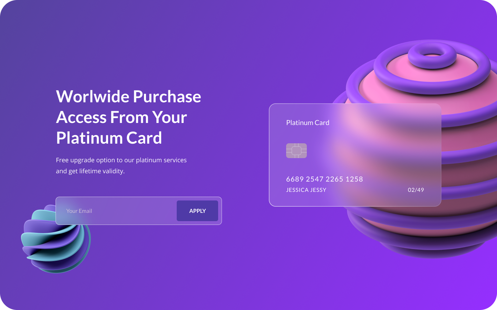

 

    

  <h3 align="center">Landing Page Platinum Card</h3>
  
  

     
        Realização da criação da landing page Platinum Card com base no modelo desenvolvido no figma (#Modelo)

        
     
  

## Índice

- [Update](#update) - Ainda por fazer
- [Techs](#techs)
- [Cores](#cores)
- [Modelo](#modelo)
- [Tipo de fonte](#tipo-de-fonte)

# Update: (Ainda por fazer)
- Desenvolvimento da parte mobile
- Adição de novos recursos no template
- Adição de menu

# Techs:

- HTML
- CSS
- FIGMA

## Cores:

    Branco: #FFF;
    Purple: #4f3aa7;
    background: linear-gradient(to right, #55439e, #952fff);

## Modelo:

O modelo da landing page foi retirada do site <a href="https://www.uplabs.com/posts/glassmorphism-header-concept">Glassmorphism Header Concept</a> 
Com todos os créditos de design do figma para: <a href="https://www.uplabs.com/rhagency">RHAGENCY</a> 

## Tipo de fonte:

  font-family: 'Nunito', sans-serif;1
